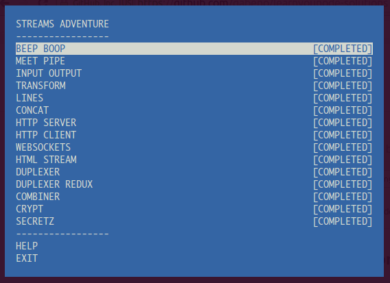

This are my solutions to @substack's https://github.com/substack/stream-adventure

It was a good learning experience working through this exercise. I had a bit of difficulty and need to follow up with more detailed study on streams and node in general.

I will journal my progress on my [blog](http://gabeno.github.io/)